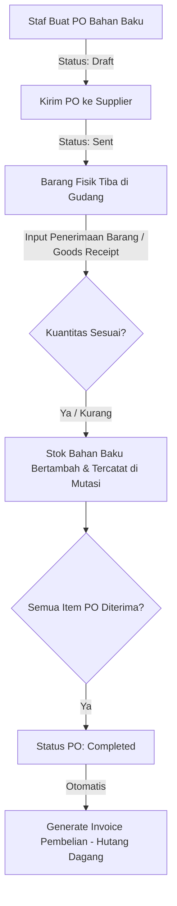
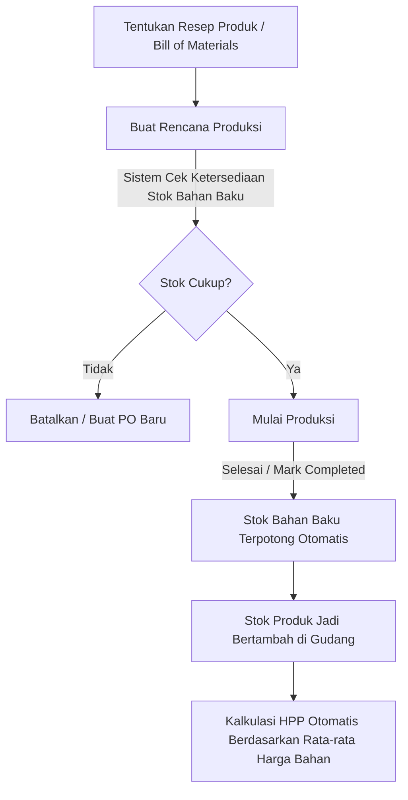
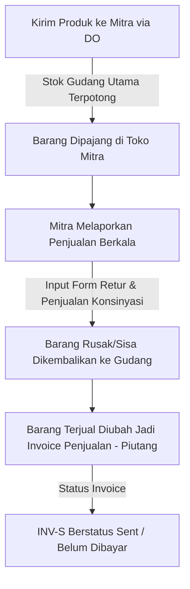
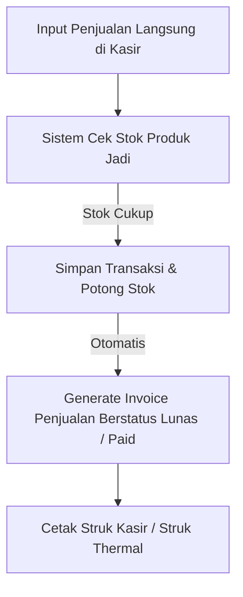
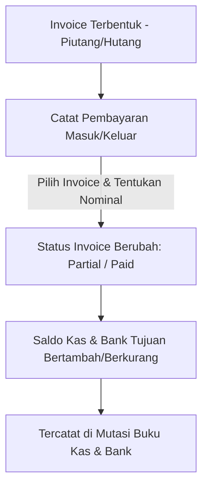

# Dokumen Panduan Sistem & Dokumentasi ERP - CV. New Citra Indonesia

Selamat datang di Dokumentasi Resmi Aplikasi **Enterprise Resource Planning (ERP) CV. New Citra Indonesia**. Dokumen ini dirancang secara khusus agar Anda dapat memahami secara menyeluruh arsitektur, peran pengguna, alur proses bisnis, fitur-fitur utama, serta panduan operasional pada setiap halaman aplikasi untuk kemudian disajikan kepada pihak *client*.

---

## 🛠️ Tech Stack & Fondasi Sistem

Aplikasi ini dibangun menggunakan arsitektur modern yang mengedepankan performa tinggi, keamanan data, dan kemudahan pemeliharaan:
- **Framework Utama**: Laravel 11.x (PHP 8.2+) dengan arsitektur MVC (Model-View-Controller).
- **Antarmuka (Frontend)**: Laravel Breeze (Blade Template) yang dipadukan dengan **Tailwind CSS (v3)** untuk desain responsif dan interaktif, **AlpineJS** untuk komponen reaktif ringan, dan **jQuery (AJAX)** untuk penanganan formulir dinamis tanpa memuat ulang halaman.
- **Basis Data**: MySQL dengan optimasi tipe data kuantitas presisi tinggi (`decimal(10, 4)`) pada modul gudang, penerimaan barang, dan invoice guna mendukung satuan pecahan (seperti `2.5` kg, `0.75` liter) tanpa pembulatan tidak akurat.
- **Library Pendukung**: 
  - **Spatie Laravel-Permission**: Pengendali akses berdasarkan hak peran (Role-Based Access Control).
  - **Barryvdh DomPDF**: Engine pembuat dokumen cetak PDF (Nota, Surat Jalan, Invoice) berukuran A4.
  - **Maatwebsite Laravel-Excel**: Modul ekspor-impor data ke format Spreadsheet/Excel.
  - **Chart.js**: Library visualisasi grafik keuangan pada dashboard analitik.

---

## 👥 Hak Peran Pengguna (Role-Based Access Control)

Aplikasi memiliki tingkat keamanan ketat melalui pembagian peran pengguna (role) yang membatasi menu yang dapat diakses:

| Peran (Role) | Hak Akses Utama | Deskripsi Pekerjaan |
| :--- | :--- | :--- |
| **Superadmin** | Seluruh Menu Sistem | Pemilik sistem yang memiliki akses tak terbatas, termasuk modul **Manajemen Pengguna (Users)** untuk menambah, mengedit, atau menonaktifkan akun staf. |
| **Admin** | Master Data, Gudang, Produksi, Purchasing, Penjualan, Keuangan, Laporan | Staf operasional utama yang mengawasi seluruh aktivitas transaksi, memvalidasi keuangan, mencatat pembayaran, dan membaca laporan keuangan. |
| **Produser** | Master Data Produk/Bahan, Gudang, Produksi, Purchasing, Penerimaan Barang | Kepala bagian produksi dan logistik. Bertanggung jawab atas ketersediaan bahan baku, resep makanan (BOM), pembelian ke supplier (PO), penerimaan barang fisik, dan eksekusi produksi barang jadi. |
| **Sales** | Surat Jalan Konsinyasi, Retur/Laba Konsinyasi, Penjualan Langsung (Kasir) | Staf lapangan atau kasir. Bertugas melayani penjualan langsung tunai (kasir) serta mendistribusikan barang konsinyasi ke toko-toko mitra dan mencatat retur sisa barang. |

---

## 🔄 Alur Sistem Utama (Core Workflows)

Berikut adalah visualisasi dan penjelasan mengenai alur kerja operasional antar-modul di dalam sistem ERP:

### 1. Alur Pengadaan Bahan Baku (Purchasing to Stock)

- **Keterangan**: Sistem mendukung penerimaan barang bertahap (*partial receipt*). Stok gudang hanya akan bertambah berdasarkan jumlah fisik barang yang sebenarnya diterima (*Quantity Received*), bukan berdasarkan jumlah yang dipesan jika ada selisih.

### 2. Alur Manufaktur / Produksi (Manufacturing Workflow)

### 3. Alur Penjualan Konsinyasi (Consignment Sales)

### 4. Alur Penjualan Langsung / Kasir (Direct Sales)

- **Keterangan**: Karena Penjualan Langsung merupakan transaksi tunai seketika, invoice yang terbentuk langsung ditandai dengan status **Lunas (Paid)** di sistem Keuangan dan dana otomatis masuk ke akun kas yang dipilih.

### 5. Alur Keuangan & Rekonsiliasi Kas (Financial Flow)

---

## 📄 Penjelasan Tiap Halaman Aplikasi

Berikut adalah panduan detail mengenai fungsi, tata letak, dan elemen interaktif pada setiap halaman utama yang ada di sistem ERP:

### 1. Dashboard Analitik (`/dashboard`)
- **Fungsi**: Halaman utama setelah login yang memberikan rangkuman kinerja operasional real-time.
- **Elemen Halaman**:
  - **KPI Cards**: Menampilkan data *Penjualan Bulan Ini* (berdasarkan Penjualan Langsung), *Pembelian Bahan Baku Bulan Ini* (berdasarkan PO Completed), dan *Konsinyasi Aktif* (jumlah Surat Jalan yang belum direkonsiliasi). Kartu ini dilengkapi efek hover melayang dinamis.
  - **Peringatan Stok Menipis**: Tabel otomatis yang memfilter seluruh Bahan Baku dan Produk Jadi yang kuantitasnya $\le 10$. Dilengkapi tombol lencana aksi (*pill button*) untuk langsung membuat Purchase Order (jika bahan baku menipis) atau membuat Rencana Produksi (jika produk jadi menipis).

### 2. Manajemen Pengguna (`/users`)
- **Fungsi**: Mengelola kredensial staf yang memiliki akses ke aplikasi (Khusus Superadmin).
- **Elemen Halaman**: Form tambah pengguna, edit peran (Superadmin, Admin, Produser, Sales), serta tombol hapus pengguna.

### 3. Master Supplier (`/suppliers`)
- **Fungsi**: Mengelola data pabrik, distributor, atau pihak ketiga penyedia bahan baku.
- **Elemen Halaman**: Tabel Data Supplier (Nama, Telepon, Email, Alamat) dengan fitur ekspor data ke Excel, unduh template impor, serta impor data masal menggunakan file Excel untuk efisiensi input.

### 4. Master Toko / Mitra (`/stores`)
- **Fungsi**: Mengelola data gerai, toko retail, atau mitra konsinyasi yang bekerja sama mendistribusikan produk.
- **Elemen Halaman**: Tabel Data Toko dengan kategori kemitraan (Agen, Reseller, Toko Utama) yang memengaruhi kebijakan harga jual produk. Dilengkapi fitur ekspor-impor Excel.

### 5. Bahan Baku (`/materials`)
- **Fungsi**: Mengelola daftar persediaan bahan mentah dan packaging (kemasan).
- **Elemen Halaman**: Nama bahan baku, jenis (Bahan Baku, Kemasan), satuan ukuran (KG, Gram, Pcs), harga beli rata-rata, dan histori harga. Halaman ini menggunakan DataTables modern sehingga pencarian dan pagination berjalan instan di sisi klien.

### 6. Produk Jadi & Resep (`/products`)
- **Fungsi**: Mengelola daftar makanan/barang jadi yang siap dijual beserta formula produksinya.
- **Elemen Halaman**:
  - **Daftar Produk**: Nama produk, harga jual (berdasarkan kategori toko), dan kemasan.
  - **Bill of Materials (BOM) / Resep**: Tombol detail yang menampilkan resep pembuatan produk. Di halaman detail, pengguna dapat memasukkan bahan baku apa saja yang dibutuhkan beserta kuantitas takarannya untuk membuat 1 unit produk jadi. Sistem akan otomatis menghitung estimasi HPP produk berdasarkan total harga bahan baku dalam resep.

### 7. Purchasing / PO (`/purchase-orders`)
- **Fungsi**: Mencatat pesanan pembelian bahan baku ke supplier untuk menghindari selisih harga dan jumlah.
- **Elemen Halaman**:
  - **Daftar PO**: Menampilkan nomor PO, nama supplier, total nilai pembelian, tanggal pesanan, dan status (`Draft`, `Sent`, `Completed`).
  - **Cetak Nota Ganda**: Pada detail PO, terdapat dua opsi cetak PDF: **Cetak Nota Supplier (Tagihan)** untuk konfirmasi tagihan resmi dari supplier, dan **Cetak Nota Konsinyasi (Mitra)** untuk barang konsinyasi masuk dengan lencana ungu khusus.
  - **Proses Penerimaan**: Tombol cepat untuk mengarahkan pengguna ke halaman Penerimaan Barang jika PO telah berstatus `Sent`.

### 8. Penerimaan Barang / Goods Receipt (`/goods-receipts`)
- **Fungsi**: Mencatat kedatangan barang fisik di gudang berdasarkan Purchase Order.
- **Elemen Halaman**: Form input kuantitas barang yang diterima secara riil. Kuantitas mendukung desimal. Jika jumlah barang yang diterima kurang dari jumlah pesanan, status PO akan tetap aktif menunggu sisa pengiriman. Jika semua telah cocok, sistem otomatis merilis stok bahan baku ke gudang dan membuat data invoice di sistem keuangan.

### 9. Gudang / Stok (`/inventory`)
- **Fungsi**: Memantau saldo akhir stok bahan baku dan produk jadi secara terintegrasi.
- **Elemen Halaman**:
  - **Saldo Stok**: Tabel real-time sisa stok bahan baku dan produk jadi.
  - **Riwayat Mutasi**: Log audit trail lengkap yang mencatat setiap penambahan dan pengurangan stok (misal: "Stok keluar akibat Produksi #PRD-001", "Stok masuk akibat GR #GR-002").

### 10. Produksi (`/productions`)
- **Fungsi**: Mencatat aktivitas dapur/pabrik dalam memproduksi produk jadi dari bahan mentah.
- **Elemen Halaman**: Form tambah produksi (pilih produk dan jumlah yang ingin dibuat). Sistem akan otomatis menghitung kebutuhan total bahan baku berdasarkan resep. Jika stok bahan di gudang tidak mencukupi, sistem akan menolak proses produksi dengan pesan peringatan detail. Ketika ditandai selesai (`Completed`), stok bahan baku terpotong dan produk jadi bertambah secara otomatis.

### 11. Konsinyasi DO (`/consignments`)
- **Fungsi**: Mencatat pengiriman barang ke toko mitra dengan sistem titip jual (Konsinyasi).
- **Elemen Halaman**: Form pembuatan Surat Jalan / Delivery Order (DO). Staf memilih toko mitra, tanggal kirim, dan daftar produk beserta jumlahnya. Cetak PDF Surat Jalan disediakan dengan desain formal untuk ditandatangani sopir dan penerima toko.

### 12. Retur & Rekonsiliasi Konsinyasi (`/returns`)
- **Fungsi**: Mencatat laporan bulanan dari toko mitra mengenai jumlah barang terjual dan sisa barang.
- **Elemen Halaman**: Form rekapitulasi. Pengguna menginput jumlah barang terjual (yang akan diubah sistem menjadi Invoice Piutang berstatus belum lunas) dan jumlah barang retur (sisa/rusak yang akan dikembalikan secara fisik ke gudang utama).

### 13. Penjualan Langsung / Kasir (`/direct-sales`)
- **Fungsi**: Modul kasir (Point of Sales) untuk penjualan produk langsung secara tunai ke pelanggan umum atau mitra.
- **Elemen Halaman**: Form transaksi dinamis berbasis AJAX. Kasir memilih produk, kuantitas, dan sistem otomatis mengisi harga jual. Begitu disimpan, transaksi dicatat sebagai penjualan langsung, stok terpotong, dan sistem otomatis membuat invoice penjualan berstatus **Lunas (Paid)** di pembukuan keuangan.

### 14. Riwayat Invoice (`/invoices`)
- **Fungsi**: Pusat kendali piutang (penjualan) dan hutang (pembelian) dagang perusahaan.
- **Elemen Halaman**:
  - **KPI Total Piutang & Hutang**: Menampilkan total tagihan belum terbayar.
  - **KPI Total Overdue**: Menampilkan nominal tagihan yang telah melewati tanggal jatuh tempo pembayaran.
  - **Tabel Invoice**: Bersifat *read-only* untuk memantau invoice yang terbentuk otomatis dari alur purchasing, konsinyasi, dan penjualan langsung. Pengguna dapat melakukan cetak ulang invoice PDF atau membuka detail untuk memproses status kirim/batal.

### 15. Pembayaran (`/payments`)
- **Fungsi**: Mencatat pelunasan invoice piutang pelanggan atau invoice hutang ke supplier.
- **Elemen Halaman**: Form catat pembayaran. Pengguna memilih invoice yang akan dicicil/dilunasi, nominal pembayaran, tanggal bayar, dan akun Kas & Bank tujuan (misal: "Transfer Bank BCA"). Status invoice akan otomatis ter-update secara *real-time*.

### 16. Kas & Bank (`/cash-banks`)
- **Fungsi**: Mengelola akun penyimpanan uang perusahaan (rekening bank, brankas, kas kecil).
- **Elemen Halaman**: Nama akun, saldo saat ini, tombol transaksi manual (debit/kredit) untuk biaya operasional atau pendapatan non-usaha, serta mutasi lengkap keluar masuk uang di setiap akun.

### 17. Dashboard Laporan Keuangan (`/reports`)
- **Fungsi**: Menyajikan laporan kesehatan finansial perusahaan secara visual dan mudah dipahami oleh pemilik usaha (*dashboard visual*).
- **Elemen Halaman**:
  - **Grafik Laba Rugi (Bar Chart)**: Membandingkan Pendapatan, HPP, Biaya Operasional, dan Laba Bersih bulan berjalan.
  - **Grafik Arus Kas (Doughnut Chart)**: Visualisasi proporsi uang masuk vs uang keluar.
  - **Detailed Reports Access**: Tautan interaktif menuju detail laporan akuntansi lengkap:
    - **Laporan Laba Rugi**: Detail perhitungan laba kotor dan laba bersih pasca-pengurangan biaya operasional.
    - **Laporan Piutang Dagang**: Daftar toko mitra yang masih menunggak pembayaran beserta umur piutang.
    - **Laporan Hutang Dagang**: Daftar supplier yang belum dilunasi tagihannya beserta tanggal jatuh tempo.
    - **Laporan Arus Kas**: Aliran uang masuk dan keluar berdasarkan kategori aktivitas operasional.